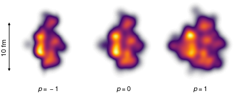

T\ :sub:`R`\ ENTo
=================
*Reduced Thickness Event-by-event Nuclear Topology*

Initial condition model for high-energy nuclear collisions.

Read the docs at `qcd.phy.duke.edu/trento <http://qcd.phy.duke.edu/trento>`_.

.. |br| raw:: html

    

   |br| Pb-Pb events generated by the model using different *p*-means
